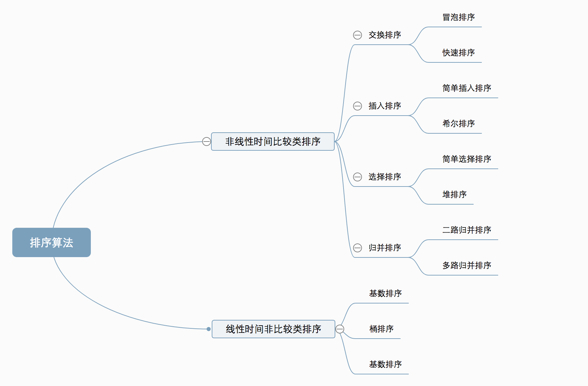

## 算法分类

十种常见排序算法可以分为两大类:

> **非线性时间比较类排序**:通过比较来决定元素间的相对次序,由于其时间复杂度不能突破O(nlogn),因此称为非线性时间比较类排序
> **线性时间非比较类排序**:不通过比较来决定元素间的相对次序,它可以突破基于比较排序的时间下界,以线性时间运行,因此称为线性时间非比较类排序

 

## 算法复杂度
 

## 相关概念

> **稳定**:如果a原本在b前面,而a=b,排序之后a仍然在b的前面
> **不稳定**:如果a原本在b的前面,而a=b,排序之后 a 可能会出现在 b 的后面
> **时间复杂度**:对排序数据的总的操作次数.反映当n变化时,操作次数呈现什么规律
> **空间复杂度**:是指算法在计算机内执行时所需存储空间的度量,它也是数据规模n的函数

## 参考链接

* [十大经典排序算法(动图演示)](https://www.cnblogs.com/onepixel/p/7674659.html) 